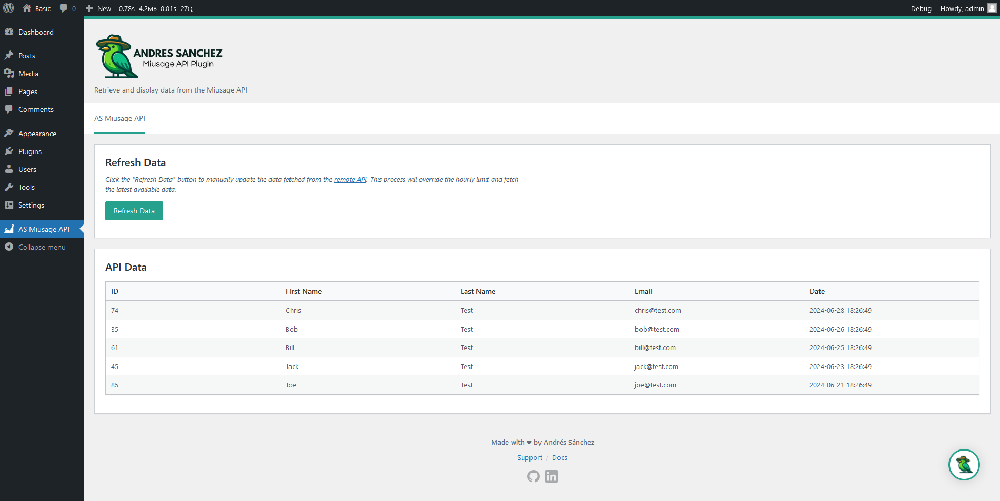
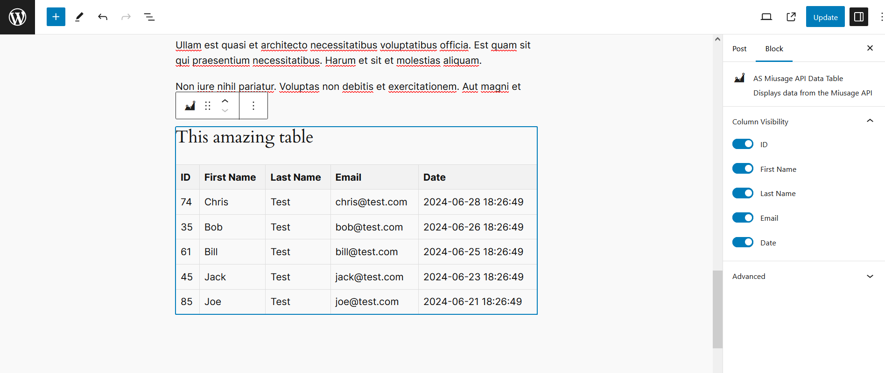
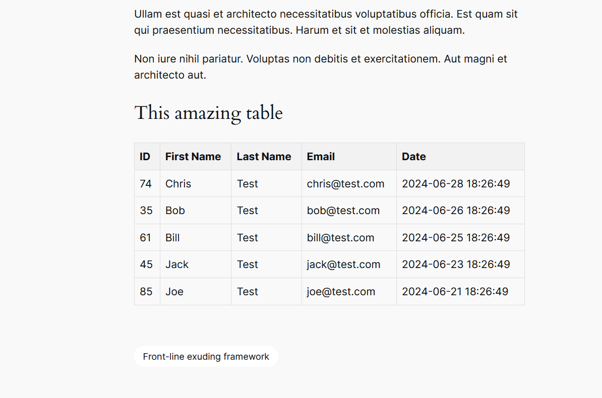

# AS Miusage API Plugin

## Description

AS Miusage API Plugin is a WordPress plugin. It retrieves data from a remote API endpoint, caches it, and makes it accessible through a custom WordPress API endpoint. The plugin features a Gutenberg block for displaying the data, an admin page for data management, and a WP-CLI command for refreshing the data.

## Features

- Custom API endpoint for retrieving cached data
- Gutenberg block for displaying data with toggleable columns
- Admin page for data display and management
- WP-CLI command for forcing data refresh
- Hourly caching of API data
- Multilingual support
- Proper data sanitization, escaping, and validation throughout the plugin

## Installation

### Option 1: Install from WordPress Admin Panel

1. Download the plugin zip file from the [latest release](https://github.com/andresj-sanchez/as-miusage-api-plugin-project/releases/tag/v1.0.0).
2. Log in to your WordPress admin panel.
3. Go to Plugins > Add New.
4. Click on the "Upload Plugin" button at the top of the page.
5. Choose the downloaded zip file and click "Install Now".
6. After installation, click "Activate Plugin" to enable the AS Miusage API Plugin.

### Option 2: Manual Installation for Development

1. Clone this repository into your WordPress plugins directory:
   ```
   git clone https://github.com/andresj-sanchez/as-miusage-api-plugin-project.git
   ```
2. Navigate to the plugin directory:
   ```
   cd plugins/as-miusage-api-plugin
   ```
3. Install dependencies:
   ```
   composer install
   npm install
   ```
4. Build assets:
   ```
   npm run build
   ```
5. Navigate to the Block directory and install its dependencies:
   ```
   cd src/Block
   npm install
   npm run build
   ```
6. Activate the plugin through the WordPress admin interface.

## Usage

### Gutenberg Block

1. Add the "AS Miusage API Data Table" block to your post or page.
2. Use the block settings to toggle column visibility.

### Admin Page

1. Navigate to "AS Miusage API" in the WordPress admin menu.
2. View the data table and use the "Refresh Data" button to update the cache.

### WP-CLI Command

To force a data refresh, use the following command:

```
wp as-miusage-api refresh
```

## Screenshots

### Admin Page


_The plugin's admin page displaying the data table and refresh button._

### Gutenberg Block


_The AS Miusage API Data Table block in the Gutenberg editor._

### Frontend Display


_How the data table appears on the frontend of the website._

## Development

### Prerequisites

- Docker
- Docker Compose
- Node.js and npm

### Local Development Setup

1. Start the Docker environment:
   ```
   docker-compose up -d
   ```
2. Wait for the WordPress container to fully initialize. This may take a few minutes as it runs configuration scripts.
3. Access the WordPress site at `http://localhost:8080`

### Building Assets

- To build assets once:
  ```
  npm run build
  ```
- For development with watch mode:
  ```
  npm run start
  ```

### Code Standards

This project follows WordPress coding standards. To check your code, run:

```
composer run-script phpcs
```

To automatically fix some coding standard issues, run:

```
composer run-script phpcbf
```

## Translations

The plugin is translation-ready. All user-facing strings are wrapped in translation functions. The main POT file is located at:

```
assets/languages/as-miusage-api-plugin.pot
```

## License

This project is licensed under the GNU General Public License v2.0 or later (GPL-2.0-or-later).

- For a full copy of the license, see the [LICENSE](LICENSE) file in this repository.
- For more information about the GPL-2.0 license, visit: [https://www.gnu.org/licenses/gpl-2.0.html](https://www.gnu.org/licenses/gpl-2.0.html)
